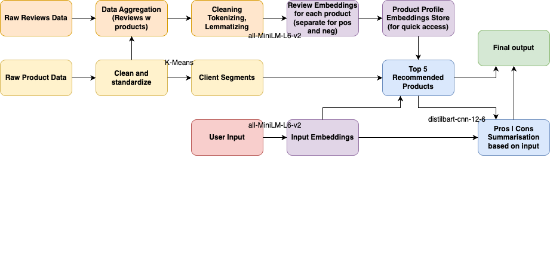

# Sephora Product Analysis


This repository contains the code and resources for a personalized product recommendation system for Sephora, focusing on skincare. [cite_start]The system analyzes product descriptions and customer reviews to segment clients, generate tailored recommendations, and provide insightful PROS/CONS summaries for each suggested product.

## Project Objectives

The primary objective was to create an intelligent recommendation system that suggests products most relevant to a user's specific skincare concerns (e.g., "oily skin," "dry skin") and their client profile. [cite_start]It aims to provide clear explanations for recommendations through automatically generated "PROS" and "CONS" summaries from aggregated review texts.

## Features & Functionality

* [cite_start]**Personalized Recommendations:** Suggests top 5 products based on user input (skincare concern) and client segment.
* [cite_start]**Client Segmentation:** Divides customers into distinct segments using K-Means clustering, based on purchasing behavior and product interactions.
* [cite_start]**Review Analysis & Summarization:** Processes vast amounts of customer reviews to extract semantic insights and generate concise "PROS" and "CONS" summaries for recommended products.
* [cite_start]**Data Preprocessing Pipeline:** Includes cleaning, tokenizing, and lemmatizing review text (using NLTK) [cite: 74, 75, 139][cite_start], as well as aggregating reviews and calculating segment-specific statistics.

## Recommendation Flow & Architecture

The system operates through a multi-stage pipeline, from raw data processing to personalized recommendation generation.



## Implementation Details

### Dataset
We utilized a Kaggle dataset comprising Sephora product information and customer reviews, which were aggregated using product IDs for comprehensive analysis.

### Data Preprocessing
Raw review texts underwent cleaning (lowercase conversion, punctuation removal) and lemmatization using NLTK for standardization. Positive and negative reviews for each product were aggregated and capped to a manageable length. Additionally, segment-specific statistics like average user ratings and review counts were calculated for each product.

### Client Segmentation
K-Means clustering was employed for client segmentation, with the optimal number of clusters (`k`) determined using silhouette analysis to ensure distinct and meaningful segments. This analysis identified 14 customer segments, including 'Contented Loyalists' (82,734 customers) and 'High-Spending, Prolific Reviewing Brand Connoisseurs' (4,263 customers). 

### Semantic Analysis & Summarization
Review texts and user inputs were converted into numerical embeddings using the `all-MiniLM-L6-v2` model for semantic understanding. For generating "PROS" and "CONS" summaries, the `distilbart-cnn-12-6` model was used to provide concise explanations for recommended products.

### Recommendation Logic
Product scores are refined based on how well a product matches a user's concern, its rating within the user's client segment, and the total number of reviews (as an indicator of trustworthiness).

## Final Results & Limitations

The project yielded very promising results in generating personalized recommendations. Identified limitations include computational power constraints and the quality of the reasoning summaries for certain recommendations.

## Technology Stack

* **Data Analysis & ML:** Python, NLTK, scikit-learn (K-Means), `all-MiniLM-L6-v2` (for embeddings), `distilbart-cnn-12-6` (for summarization)
* **Data Source:** Kaggle

## Setup

1.  Clone the repository:

    ```bash
    git clone [https://github.com/your-username/SephoraProductAnalysis.git](https://github.com/your-username/SephoraProductAnalysis.git)
    cd SephoraProductAnalysis
    ```

2.  Create a virtual environment (recommended):

    ```bash
    python -m venv venv
    source venv/bin/activate  # On macOS/Linux
    venv\Scripts\activate  # On Windows
    ```

3.  Install dependencies:

    ```bash
    pip install -r requirements.txt
    ```

4.  Download the Sephora dataset:

    * Make sure you have the Kaggle CLI installed and configured. If not, follow the instructions on the [Kaggle CLI GitHub page](https://github.com/Kaggle/kaggle-api).
    * IMPORTANT: You need to have the kaggle.json file in the `~/.kaggle` directory.
    * Run the download script:

        ```bash
        ./data/download_data.sh
        ```
